# Thesis Graphical Representation Plan

This file reviews the current thesis PDF (`2024-MSDS-109.pdf`) and gives a corrected
figure/graph placement plan according to the implemented code and documented results.
Use this as a guide while inserting figures into the Word/PDF thesis.

## 1. Main Review Findings

The thesis content is aligned with the codebase, but the graphical representation needs
these corrections:

1. **List of Figures is not fully aligned with the generated figure assets.**
   - The current thesis lists Figure 3.1 as research motivation.
   - The generated asset for motivation is now `Figure_1_1_research_motivation.svg`.
   - The thesis should use chapter-wise numbering: Chapter 1 figures as 1.x,
     Chapter 3 figures as 3.x, etc.

2. **Some figure captions appear in the body without the actual figure inserted.**
   - Example: in Chapter 5, captions such as "Figure 5.2..." and "Figure 5.3..."
     appear around the results section, but the actual graphics should be inserted
     immediately before/after the related table and explanatory paragraph.

3. **The results should focus on the larger UCI-format dataset where required.**
   - Larger dataset: `1025` records.
   - Class 0: `499` records.
   - Class 1: `526` records.
   - Best static model: HistGradientBoosting, accuracy `0.9805`.
   - Best adaptive model: Adaptive Random Forest, accuracy `0.8673`.
   - False-negative rate: `0.0476`.

4. **Chapter 6 needs one visual summary.**
   - The discussion compares static and adaptive models, but the current List of
     Figures does not include a Chapter 6 trade-off figure.
   - Add `Figure 6.1` to explain static-vs-adaptive trade-off.

5. **Feature importance figure should be described carefully.**
   - The available figure ranks documented important features (`ca`, `thal`, `sex`,
     `chest_pain_type`, `exercise_angina`).
   - If exact exported feature-importance scores are later available, replace the
     relative scores in the figure with exact values.

---

## 2. Corrected List of Figures

Use this updated list instead of the current one.

**LIST OF FIGURES**

Figure 1.1. Research motivation for real-time adaptive heart disease detection.  
Figure 3.1. Class distribution of the larger UCI-format heart disease dataset.  
Figure 3.2. Data preprocessing workflow for the UCI-format heart disease dataset.  
Figure 4.1. Architecture of the proposed real-time adaptive heart disease detection framework.  
Figure 4.2. Static baseline machine learning pipeline.  
Figure 4.3. Online adaptive learning workflow using prequential evaluation.  
Figure 4.4. Concept drift monitoring process using ADWIN, DDM, and Page-Hinkley.  
Figure 5.1. Accuracy comparison of baseline and adaptive models on the larger UCI-format dataset.  
Figure 5.2. Precision, recall, and F1-score comparison of evaluated models.  
Figure 5.3. ROC-AUC comparison of static baseline models.  
Figure 5.4. Adaptive model comparison on the larger UCI-format dataset.  
Figure 5.5. Synthetic drift scenario performance under sudden, gradual, and recurring drift.  
Figure 5.6. False-negative analysis for clinical risk evaluation.  
Figure 5.7. Top features for heart disease prediction.  
Figure 5.8. API latency performance of the real-time prediction endpoint.  
Figure 5.9. Comparison of the proposed framework with recent heart disease prediction studies.  
Figure 6.1. Performance trade-off between static and adaptive models.  

---

## 3. Figure Placement Plan

| Figure | File | Insert Location | Purpose |
|---|---|---|---|
| Figure 1.1 | `docs/thesis_figures/Figure_1_1_research_motivation.svg` | Chapter 1, after Section 1.1 Background and Motivation | Shows why static models, changing trends, false negatives, and adaptive diagnosis motivate the research. |
| Figure 3.1 | `docs/thesis_figures/Figure_3_1_class_distribution_1025.svg` | Chapter 3, Section 3.2 Class Distribution | Shows class balance of the larger 1025-record dataset. |
| Figure 3.2 | `docs/thesis_figures/Figure_3_2_preprocessing_workflow.svg` | Chapter 3, after Data Cleaning / before Training Split | Shows raw CSV to processed dataset workflow. |
| Figure 4.1 | `docs/thesis_figures/Figure_4_1_framework_architecture.svg` | Chapter 4, Section 4.1 Overview | Main system architecture. |
| Figure 4.2 | `docs/thesis_figures/Figure_4_2_static_baseline_pipeline.svg` | Chapter 4, Section 4.3 Static Baseline Model | Shows scikit-learn preprocessing and static model flow. |
| Figure 4.3 | `docs/thesis_figures/Figure_4_3_adaptive_learning_workflow.svg` | Chapter 4, Section 4.4 Adaptive Online Learning Model | Shows prequential online learning process. |
| Figure 4.4 | `docs/thesis_figures/Figure_4_4_drift_detection_framework.svg` | Chapter 4, Section 4.5 Concept Drift Detection | Shows detector input/output flow. |
| Figure 5.1 | `docs/thesis_figures/Figure_5_1_accuracy_comparison_1025.svg` | Chapter 5, Section 5.6 Results on Larger UCI-format Dataset | Shows accuracy of LogReg, Adaptive LR, ARF, and HGB. |
| Figure 5.2 | `docs/thesis_figures/Figure_5_2_precision_recall_f1_1025.svg` | Chapter 5, immediately after larger dataset result table | Shows available precision, recall, and F1 values. |
| Figure 5.3 | `docs/thesis_figures/Figure_5_3_roc_auc_static_models.svg` | Chapter 5, after discussion of ROC-AUC | Shows ROC-AUC for static models. |
| Figure 5.4 | `docs/thesis_figures/Figure_5_4_adaptive_model_comparison_1025.svg` | Chapter 5, adaptive result paragraph | Compares adaptive Online LR and Adaptive Random Forest. |
| Figure 5.5 | `docs/thesis_figures/Figure_5_5_drift_scenario_performance.svg` | Chapter 5, Section 5.7 Drift Scenario Analysis | Shows synthetic sudden/gradual/recurring drift performance. |
| Figure 5.6 | `docs/thesis_figures/Figure_5_6_false_negative_analysis_1025.svg` | Chapter 5, Section 5.8 Clinical Error Analysis | Shows FN, TP, and FNR for larger dataset. |
| Figure 5.7 | `docs/thesis_figures/Figure_5_7_feature_importance.svg` | Chapter 5, Section 5.9 Explainability Results | Shows documented top predictive features. |
| Figure 5.8 | `docs/thesis_figures/Figure_5_8_api_latency.svg` | Chapter 5, Section 5.10 Real-Time API Latency Analysis | Shows Mean, P50, P95, and Max latency. |
| Figure 5.9 | `docs/thesis_figures/Figure_5_9_literature_comparison.svg` | Chapter 5, Section 5.11 Comparative Analysis | Shows proposed model against related work context. |
| Figure 6.1 | `docs/thesis_figures/Figure_6_1_static_vs_adaptive_tradeoff.svg` | Chapter 6, Section 6.3 Static Model vs Adaptive Model | Explains performance vs adaptability trade-off. |

---

## 4. Figure Previews and Captions

### Figure 1.1. Research motivation for real-time adaptive heart disease detection.

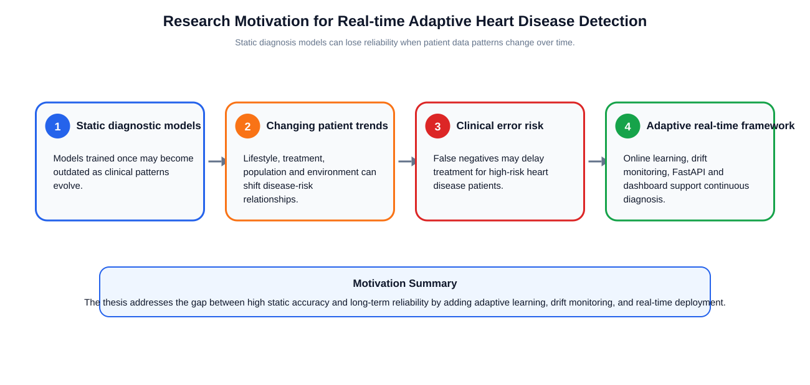

Insert after Section 1.1. Suggested paragraph before figure:

> The motivation of this work can be summarized through four connected issues:
> static models become outdated, patient trends change over time, false negatives
> create clinical risk, and real-time adaptive learning is required for reliable
> diagnostic support.

### Figure 3.1. Class distribution of the larger UCI-format heart disease dataset.

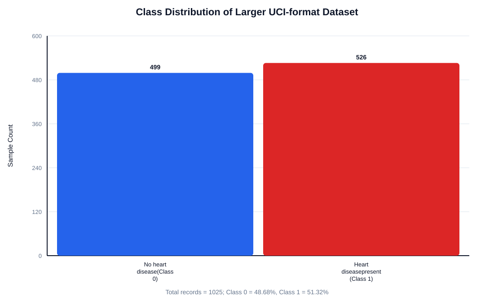

Use in Chapter 3, Section 3.2. This figure should replace any 303-only class
distribution if the chapter focuses on the larger dataset.

### Figure 3.2. Data preprocessing workflow for the UCI-format heart disease dataset.

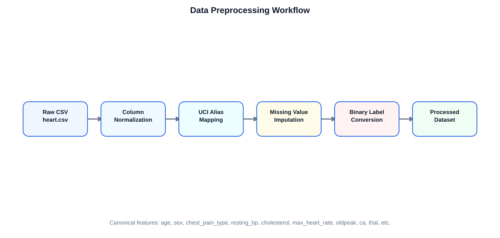

Use after the explanation of column normalization, alias mapping, missing-value
handling, and binary label conversion.

### Figure 4.1. Architecture of the proposed real-time adaptive heart disease detection framework.

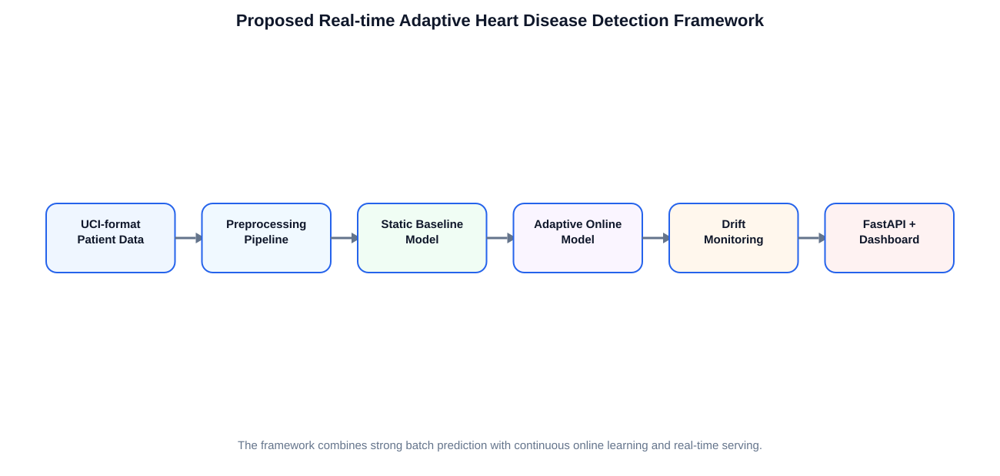

Use at the end of Section 4.1.

### Figure 4.2. Static baseline machine learning pipeline.

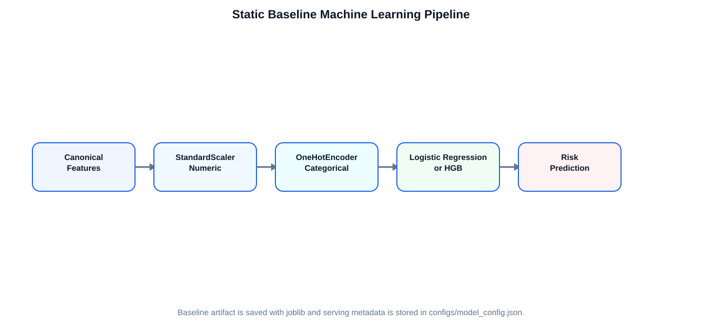

Use in Section 4.3 after the paragraph explaining `StandardScaler`,
`OneHotEncoder`, Logistic Regression, and HistGradientBoosting.

### Figure 4.3. Online adaptive learning workflow using prequential evaluation.

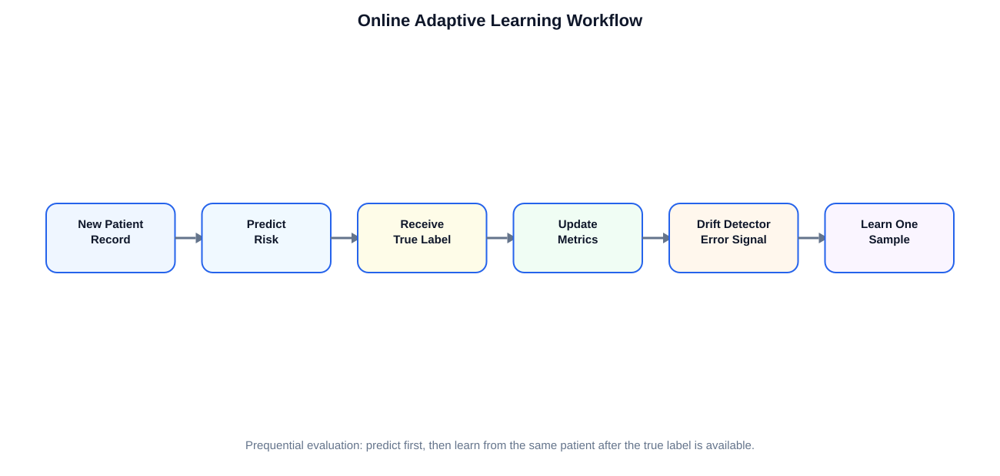

Use in Section 4.4 after listing the adaptive workflow steps.

### Figure 4.4. Concept drift monitoring process using ADWIN, DDM, and Page-Hinkley.

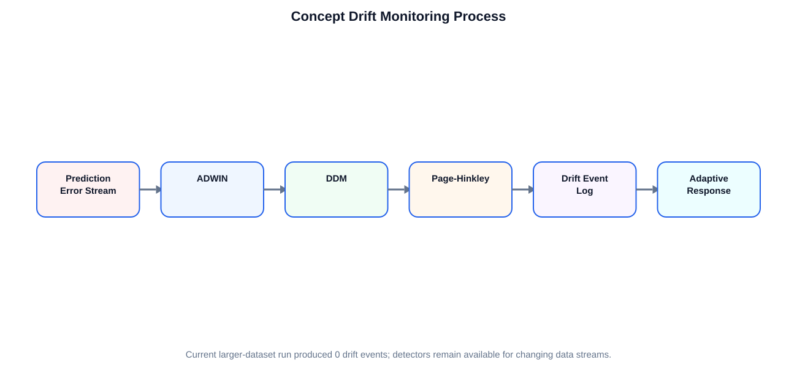

Use in Section 4.5 after explaining that detectors monitor the online error stream.

### Figure 5.1. Accuracy comparison of baseline and adaptive models on the larger UCI-format dataset.

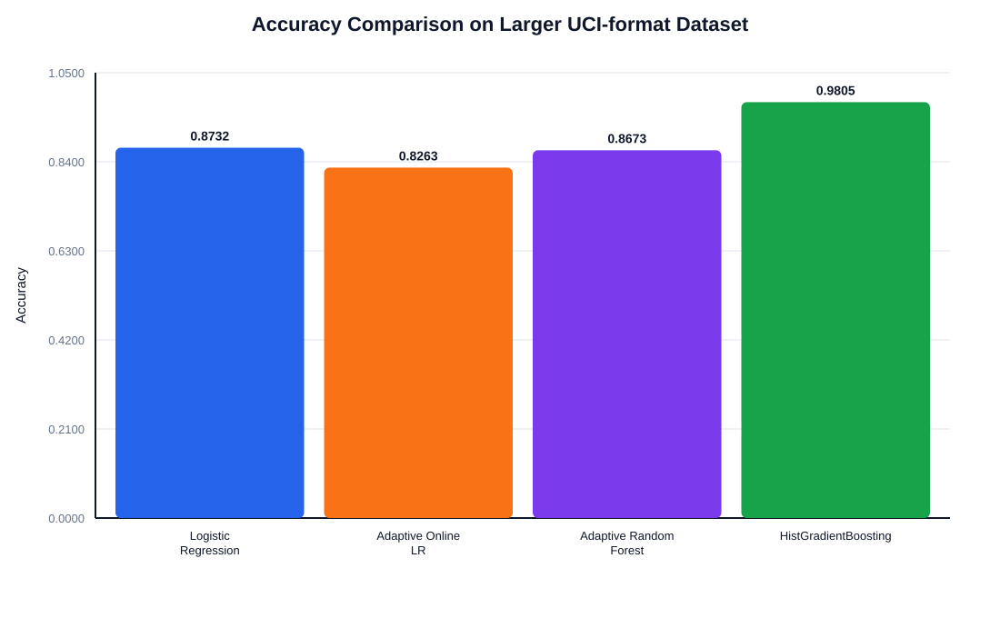

Use in Section 5.6 immediately after Table 5.6.

### Figure 5.2. Precision, recall, and F1-score comparison of evaluated models.

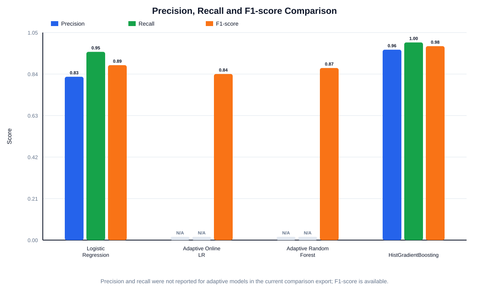

Use after Figure 5.1. The adaptive precision and recall are marked as `N/A`
because the current comparison export reports adaptive accuracy and F1 but not
adaptive precision/recall.

### Figure 5.3. ROC-AUC comparison of static baseline models.

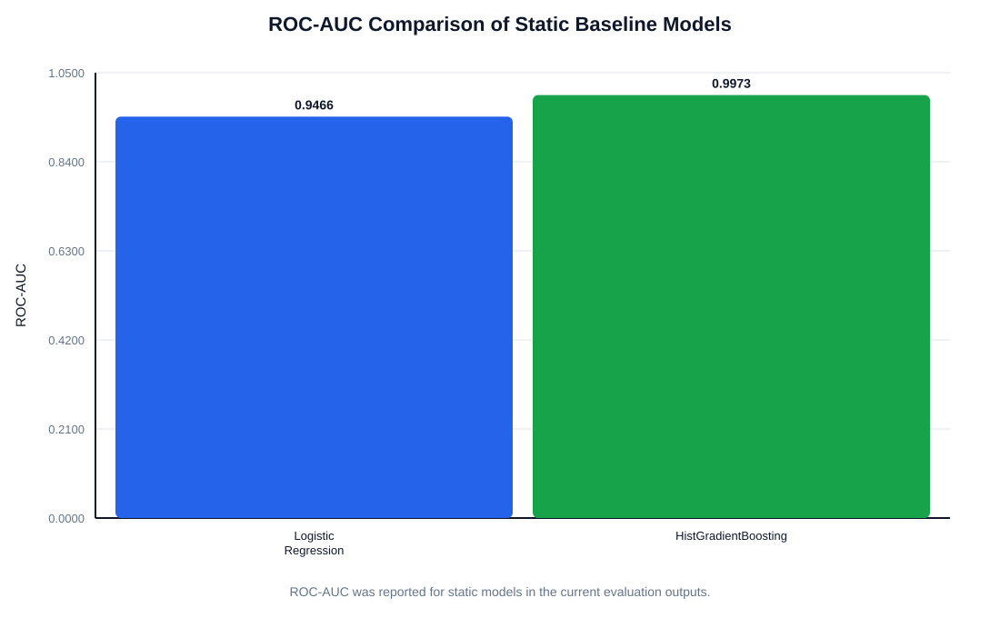

Use after discussing Logistic Regression ROC-AUC `0.9466` and HGB ROC-AUC
`0.9973`.

### Figure 5.4. Adaptive model comparison on the larger UCI-format dataset.

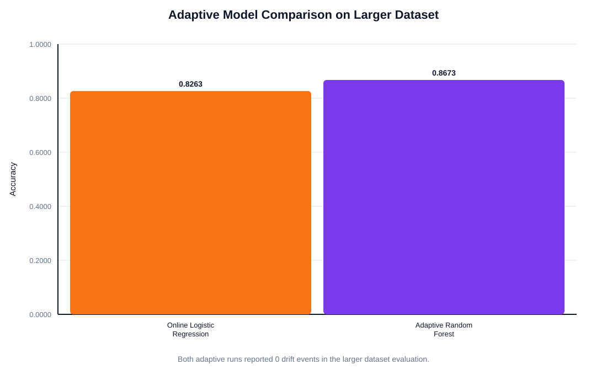

Use after the paragraph that compares Adaptive Online Logistic Regression
(`0.8263`) and Adaptive Random Forest (`0.8673`).

### Figure 5.5. Synthetic drift scenario performance under sudden, gradual, and recurring drift.

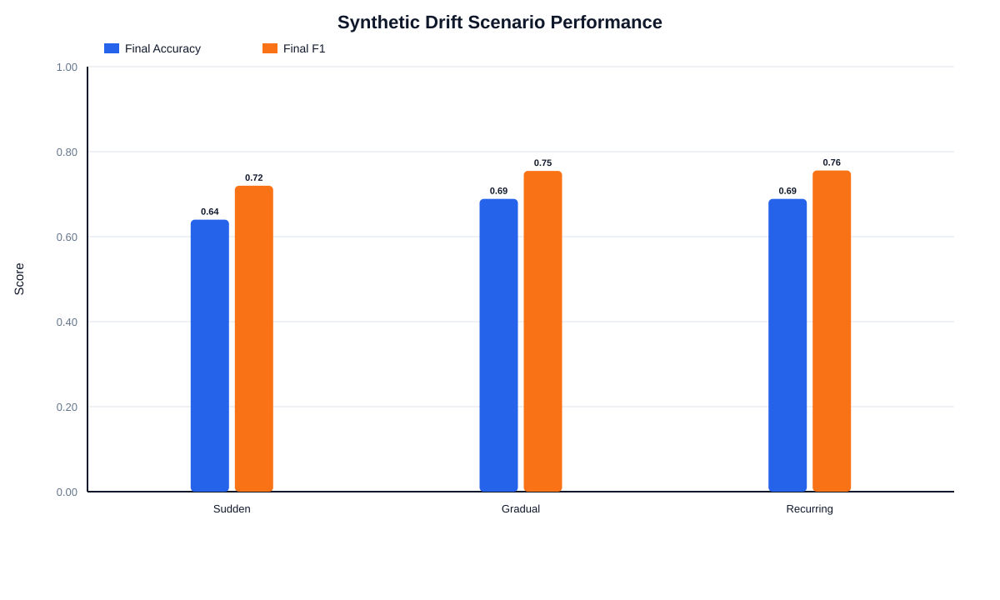

Use only in Section 5.7. This is a synthetic drift benchmark, not the 1025 static
dataset result. Keep the caption clear to avoid confusion.

### Figure 5.6. False-negative analysis for clinical risk evaluation.

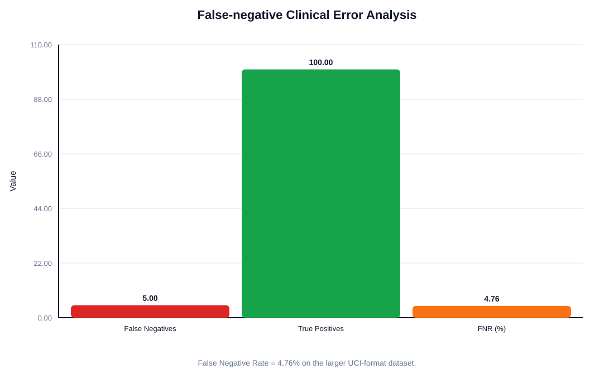

Use in Section 5.8 with larger-dataset values:

- False Negatives = 5
- True Positives = 100
- False Negative Rate = 4.76%

### Figure 5.7. Top features for heart disease prediction.

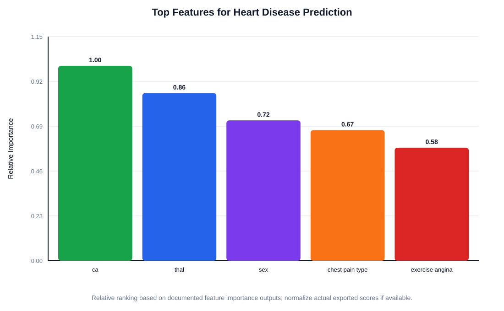

Use in Section 5.9. Suggested note:

> The feature-importance graph represents the documented top clinical predictors
> from the implemented explainability output. Exact exported scores can be updated
> if the final experiment artifact is regenerated.

### Figure 5.8. API latency performance of the real-time prediction endpoint.

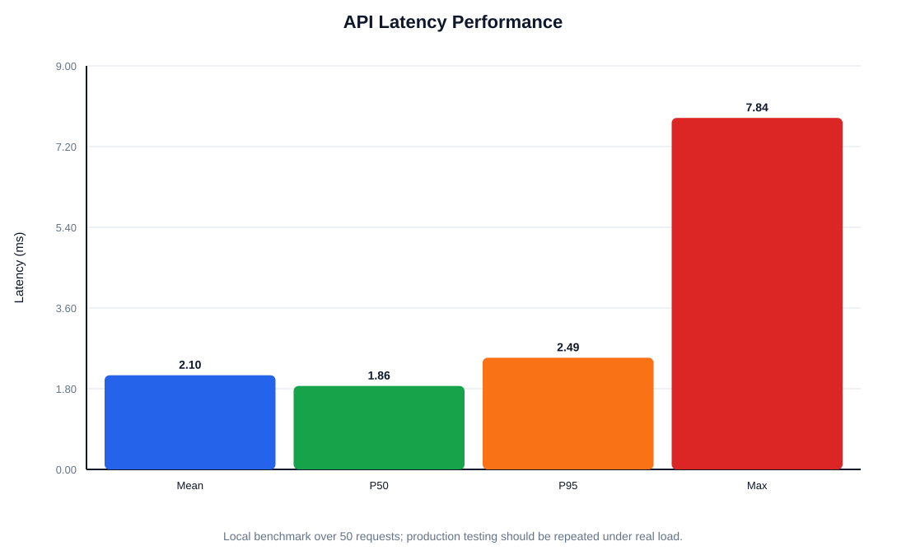

Use in Section 5.10.

### Figure 5.9. Comparison of the proposed framework with recent heart disease prediction studies.

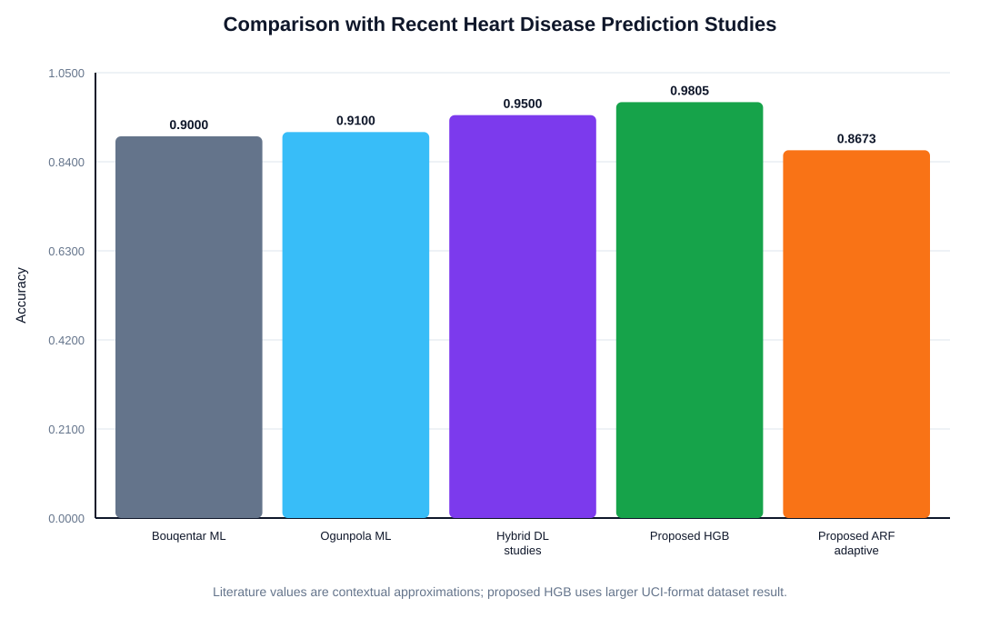

Use in Section 5.11. Mention that literature values are contextual and may use
different datasets/protocols.

### Figure 6.1. Performance trade-off between static and adaptive models.

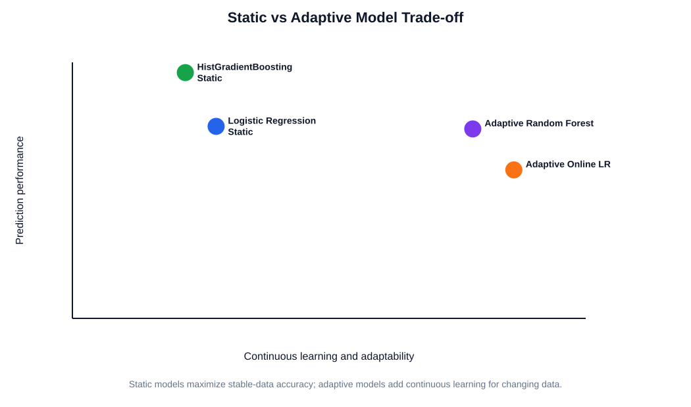

Use in Section 6.3.

---

## 5. Corrections Needed in Current Thesis Text

### 5.1 Front Matter / Table of Contents

The current table of contents still contains template entries such as:

- `1.1 FIRST LEVEL HEADINGS`
- `1.1.1 Second Level Headings`
- `2. MISCELLANEOUS INFORMATION...`

Replace the table of contents with actual thesis chapter headings.

### 5.2 List of Figures

Replace the current List of Figures with the corrected list in Section 2 of this
Markdown file.

### 5.3 Chapter 3

If the thesis focuses on the larger dataset, Section 3.2 should show:

| Class Label | Meaning | Sample Count | Percentage (%) |
|---|---|---:|---:|
| 0 | No heart disease | 499 | 48.68 |
| 1 | Heart disease present | 526 | 51.32 |
| Total | - | 1025 | 100 |

Then insert Figure 3.1.

### 5.4 Chapter 5

The current Chapter 5 mixes UCI 303 results and larger 1025 results. If the final
thesis should emphasize the larger dataset only, keep the 303 results as a secondary
or earlier benchmark and make Section 5.6 the main results section.

Recommended main result table:

| Model | Accuracy | Precision | Recall | F1-Score | ROC-AUC | Drift Events |
|---|---:|---:|---:|---:|---:|---:|
| Baseline Logistic Regression | 0.8732 | 0.8264 | 0.9524 | 0.8850 | 0.9466 | 0 |
| Adaptive Online Logistic Regression | 0.8263 | N/A | N/A | 0.8405 | N/A | 0 |
| Adaptive Random Forest | 0.8673 | N/A | N/A | 0.8707 | N/A | 0 |
| HistGradientBoosting | 0.9805 | 0.9633 | 1.0000 | 0.9813 | 0.9973 | 0 |

After this table, insert Figures 5.1, 5.2, 5.3, and 5.4.

### 5.5 Chapter 6

Add Figure 6.1 in Section 6.3, because this section discusses static vs adaptive
model trade-off.

Suggested sentence before Figure 6.1:

> Figure 6.1 summarizes the central trade-off observed in the experiments: static
> models achieve higher performance under stable distributions, while adaptive
> models provide continuous learning capability for changing future data.

---

## 6. Word/PDF Insertion Notes

1. Insert SVG directly into Word if supported.
2. If Word does not accept SVG, export each SVG to PNG from a browser:
   - Open SVG in Chrome/Edge.
   - Print/export or screenshot at high resolution.
   - Insert PNG into Word.
3. Keep every figure centered.
4. Put caption below the figure.
5. Update List of Figures after all captions are inserted.
6. Use consistent numbering with chapter number.

---

## 7. Final Recommendation

Use all figures except optional synthetic drift/literature figures if the supervisor asks
for a shorter thesis. The most important figures to keep are:

1. Figure 1.1 Research motivation
2. Figure 3.1 Class distribution
3. Figure 3.2 Preprocessing workflow
4. Figure 4.1 Framework architecture
5. Figure 4.3 Adaptive learning workflow
6. Figure 5.1 Accuracy comparison
7. Figure 5.6 False-negative analysis
8. Figure 5.8 API latency
9. Figure 6.1 Static vs adaptive trade-off

